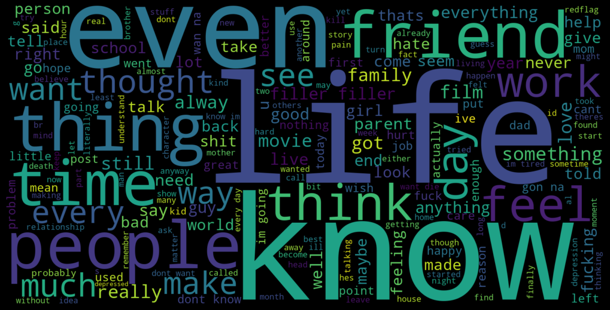

# sentiment-analysis-of-people-with-mental-illness

Keyword: nltk, wordcloud, sentiment analysis, mental health   

The dataset obtained from Kaggle consists of text from people with mental illness. As mental illness stereotypes tend to be negative, the study aim to analyze the words that come directly from the patients themselves.  

Dataset: https://www.kaggle.com/datasets/reihanenamdari/mental-health-corpus

Data visualization obtained from dataset.   
   

